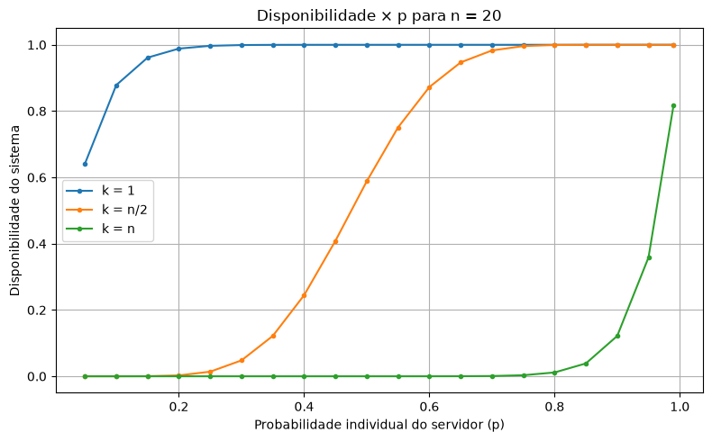
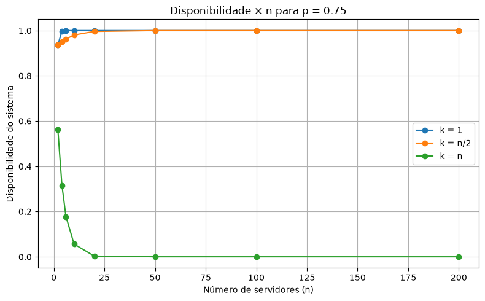
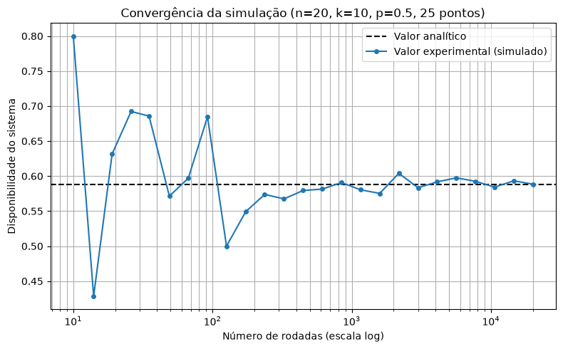
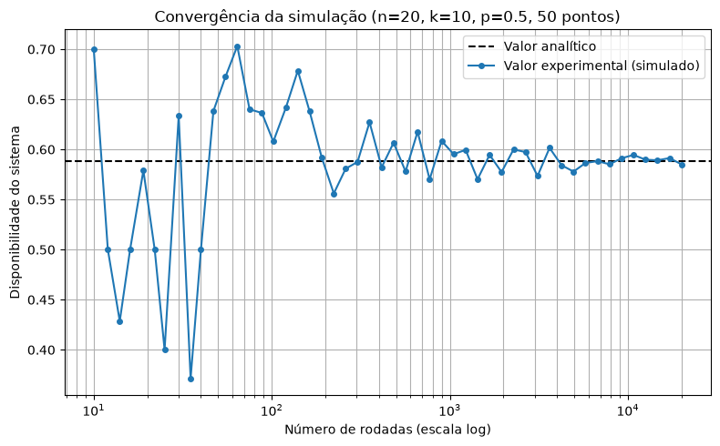

# TrabalhoCompDistribuida

Resolução dos Exercícios I da disciplina de Computação Distribuída (Prof. Nabor C.
Mendonça), respondendo aos Exercícios 1.1 e 1.2.

## Estrutura do projeto

| Arquivo | Conteúdo |
|---|---|
| `trabalho-nabor-notebook.ipynb` | Exercício 1.2: cálculo analítico da fórmula de disponibilidade e simulador estocástico, com tabelas e gráficos. |
| `main.py` | Exercício 1.2 (versão interativa): app desktop em `pygame` que roda o mesmo simulador estocástico ao vivo, com controles de n/k/p e um "jardim" de servidores. |
| `assets/fonts/` | Fontes Baloo 2 e Nunito (licença SIL OFL) usadas pelo app. |
| `assets/img/` | Gráficos exportados do notebook, usados neste README. |
| `requirements.txt` | Dependências Python do projeto. |

### Como rodar

```bash
python -m venv .venv
.venv\Scripts\activate          # Windows
pip install -r requirements.txt

# notebook (célula a célula, ou via CLI):
jupyter nbconvert --to notebook --execute --inplace trabalho-nabor-notebook.ipynb

# app interativo:
python main.py
```

---

## Exercício 1.1 - Fórmula de Disponibilidade

### Enunciado

Deduzir a disponibilidade de um serviço replicado em `n` servidores, que exige pelo menos `k` servidores disponíveis para ser acessado de forma consistente, considerando que cada servidor está disponível com probabilidade `p`, independentemente dos demais.

### Fórmula de disponibilidade

A disponibilidade do serviço é dada por:

$$
\boxed{A(n,k,p) = 1 - \sum_{i=0}^{k-1} \binom{n}{i} p^i(1-p)^{n-i}}
$$

onde:

| Elemento | Significado |
|---|---|
| $A(n,k,p)$ | Probabilidade de o serviço estar disponível |
| $n$ | Número total de servidores |
| $k$ | Número mínimo de servidores disponíveis necessário para o serviço funcionar |
| $p$ | Probabilidade de um servidor individual estar disponível |
| $1-p$ | Probabilidade de um servidor individual estar indisponível |
| $i$ | Quantidade de servidores disponíveis no caso considerado |
| $\binom{n}{i}$ | Número de maneiras de escolher `i` servidores disponíveis entre os `n` servidores |

A fórmula calcula a probabilidade de existirem pelo menos `k` servidores disponíveis. Para isso, calculei primeiro a probabilidade do evento complementar, existirem menos de `k` servidores disponíveis, e subtrai de `1`.

### Dedução da fórmula

Cada servidor possui probabilidade `p` de estar disponível e, consequentemente, probabilidade `1-p` de estar indisponível.

Por exemplo, considerando três servidores e uma situação em que exatamente dois estão disponíveis:

$$
\text{Disponível},\quad
\text{Disponível},\quad
\text{Indisponível}
$$

Como os estados dos servidores são independentes, a probabilidade dessa configuração específica é:

$$
p \cdot p \cdot (1-p) = p^2(1-p)
$$

Generalizando, se existem `n` servidores e exatamente `i` deles estão disponíveis, uma configuração específica terá `i` servidores disponíveis e `n-i` servidores indisponíveis.

Portanto, sua probabilidade é:

$$
p^i(1-p)^{n-i}
$$

Nessa expressão:

- $p^i$ representa a probabilidade associada aos `i` servidores disponíveis;
- $(1-p)^{n-i}$ representa a probabilidade associada aos `n-i` servidores indisponíveis.

Entretanto, os `i` servidores disponíveis podem ser quaisquer servidores dentre os `n` existentes.

Por exemplo, para `n = 3` e `i = 2`, existem três configurações possíveis:

$$
(D,D,I),\quad(D,I,D),\quad(I,D,D)
$$

Assim, é necessário determinar quantas maneiras existem de escolher `i` servidores disponíveis entre `n`.

Como a ordem dos servidores escolhidos não importa, utiliza-se a combinação:

$$
\binom{n}{i} = \frac{n!}{i!(n-i)!}
$$

Multiplicando a quantidade de configurações possíveis pela probabilidade de cada configuração, obtém-se a probabilidade de exatamente `i` servidores estarem disponíveis:

$$
P(X=i) = \binom{n}{i}p^i(1-p)^{n-i}
$$

onde `X` representa a quantidade de servidores disponíveis.

Portanto:

$$
\underbrace{\binom{n}{i}}_{\text{formas de escolher } i \text{ servidores}}
\cdot
\underbrace{p^i}_{\text{probabilidade dos } i \text{ disponíveis}}
\cdot
\underbrace{(1-p)^{n-i}}_{\text{probabilidade dos } n-i \text{ indisponíveis}}
$$

Até esse ponto, a expressão calcula a probabilidade de haver exatamente `i` servidores disponíveis.

Porém, o serviço exige pelo menos `k` servidores disponíveis. Assim, ele está disponível quando:

$$
X \geq k
$$

Para calcular essa probabilidade é possível somar diretamente todos os casos em que o sistema funciona:

$$
P(X=k)+P(X=k+1)+\cdots+P(X=n)
$$

ou:

$$
\sum_{i=k}^{n}
\binom{n}{i}p^i(1-p)^{n-i}
$$

Logo, a probabilidade de o sistema estar indisponível é:

$$
P(X \lt k) = \sum_{i=0}^{k-1} \binom{n}{i}p^i(1-p)^{n-i}
$$

Como a probabilidade total é igual a `1`, a disponibilidade do serviço é:

$$
A(n,k,p) = 1-P(X \lt k)
$$

Substituindo a expressão anterior:

$$
\boxed{A(n,k,p) = 1 - \sum_{i=0}^{k-1} \binom{n}{i} p^i(1-p)^{n-i}}
$$

---

## Exercício 1.2 - Cálculo analítico e simulação estocástica

### 1. Cálculo analítico

A fórmula $A(n, k, p) = 1 - \sum_{i=0}^{k-1} \binom{n}{i} p^i (1-p)^{n-i}$ foi
implementada em Python no notebook (`calcular_probabilidade_sistema_disponivel`) e avaliada
para `n ∈ {2, 4, 6, 10, 20, 50, 100, 200}` (os valores maiores servem para
expor, na Parte 2, onde a simulação diverge mais da disponibilidade "real"
dada pela fórmula), `p` numa grade densa de ~20 pontos (passo de 0,05 entre
0,05 e 0,95, mais os pontos notáveis 0,1/0,25/0,5/0,75/0,9/0,99) para suavizar
as curvas de disponibilidade × p, e os três regimes de quórum `k = 1`,
`k = n/2` e `k = n`, gerando uma tabela com 460 combinações. Os gráficos de
disponibilidade × p e disponibilidade × n são gerados por funções genéricas
(`plotar_disponibilidade_vs_p(tabela, n_alvo)` e
`plotar_disponibilidade_vs_n(tabela, p_alvo)`), parametrizadas por `n` ou `p`
em vez de fixadas num único valor, e são chamadas para mais de uma combinação
para comparação. Os gráficos confirmam o comportamento previsto em 1.1: `k=1`
satura perto de 100% rapidamente conforme `n` ou `p` crescem; `k=n` cai
conforme `n` cresce, para o mesmo `p`; `k=n/2` fica entre os dois extremos.





### 2. Simulador estocástico

No notebook, para uma combinação de `n`, `k`, `p`, o simulador
(`simular_disponibilidade`) roda um número de rodadas escolhido pelo
usuário: em cada rodada, cada servidor sorteia um número aleatório uniforme
em `[0,1]` e é considerado disponível se o número for `≤ p`; o sistema é
bem-sucedido na rodada se pelo menos `k` servidores caírem disponíveis. A
frequência de rodadas bem-sucedidas (frequência experimental) converge para
o valor analítico da Parte 1 conforme o número de rodadas aumenta, como
esperado pela Lei dos Grandes Números.

Para visualizar essa convergência, a frequência experimental é plotada para
uma grade de quantidades de rodadas espaçadas em escala logarítmica (10 a
20.000), ao lado do valor analítico (linha tracejada). Os parâmetros do
cenário (`N_CONVERGENCIA`, `K_CONVERGENCIA`, `P_CONVERGENCIA`,
`RODADAS_MIN`, `RODADAS_MAX`, `RODADAS_PONTOS`) ficam numa única célula,
isolados da função de plotagem, para serem fáceis de alterar e testar outros
cenários.

O cenário padrão (`n=20, k=n/2=10, p=0.5`) é o de maior variância: quanto
mais perto de 50% a disponibilidade do sistema, mais a estimativa oscila com
poucas rodadas, o que deixa a convergência bem visível. O valor experimental
oscila bastante nas primeiras dezenas de rodadas e se estabiliza perto do
valor analítico (≈ 0,588) conforme o número de rodadas cresce. Como cada
ponto do gráfico é uma única simulação (não uma média de várias
repetições), o desvio padrão da estimativa só cai com `1/√rodadas`, então
ocasionalmente algum ponto intermediário se afasta mais da linha analítica
antes de a curva se estabilizar.



Uma segunda chamada do mesmo gráfico usa o dobro de pontos na grade de
rodadas (mesmo intervalo, mais granularidade), gerando uma curva mais suave:



### 3. App interativo

Além do notebook, `main.py` implementa o mesmo método de simulação em um app
desktop (`pygame`/`pygame-ce`), separado do notebook para não misturar
exploração de dados com uma ferramenta de demonstração ao vivo. Cada servidor
é desenhado como uma flor (disponível) ou um botão fechado (indisponível);
sliders permitem alterar `n`, `k` e `p` em tempo real, o que reinicia a
amostragem, e um gráfico de convergência mostra a frequência experimental
acumulada se aproximando do valor analítico enquanto as rodadas rodam
continuamente.